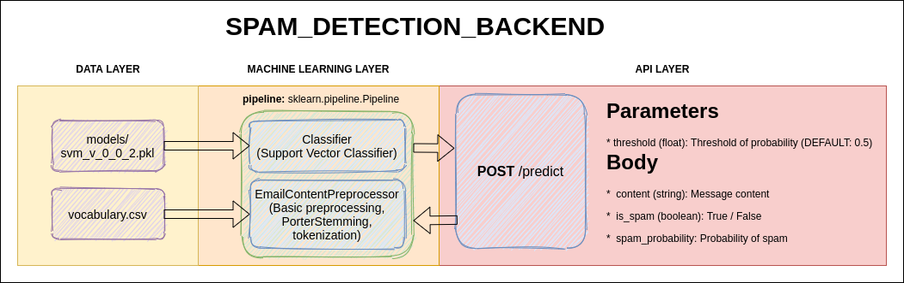

# FlaskExploration

This is hobby repository created to explore Flask framework as API creation tool for model deployment

## About

This project is classic spam detecetion NLP task.
You send request with email content and receive prediction if message is spam or not.

## Architecture

## Goal

I was curious about deployment of ML model as api with automated model training and predicting, where model will be wrapped into Flask and can be utilized using `POST` method.

* Automate model training
* Wrap into Flask APP
* Enable to interact using POST
* Wrap into Docker container
* Deploy on AWS
* Interact using Jupyter

## Guideline

* Start from [prerequisites](https://github.com/AtmosOne/FlaskExploration/blob/main/docs/Prerequisites.md)
* Then go to [web app spin up](https://github.com/AtmosOne/FlaskExploration/blob/main/docs/WebAppSpinUp.md)
* And Lastly checkout [API documentation](https://github.com/AtmosOne/FlaskExploration/blob/main/docs/API.md) & [Jupyter Example](https://github.com/AtmosOne/FlaskExploration/blob/main/Example/Example.ipynb)
