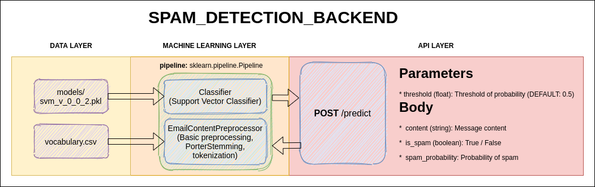
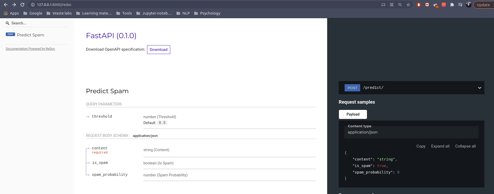

# **SPAM_DETECTION_BACKEND**

This is hobby project created to explore FastAPI as a framework for organization machine learning model as RESTful service

## **About**

In my machine learning i need some template to quickly push developed model into production + i wanted to explore FastAPI to introduce it into my technological stack.

## **Architecture**



## **Tech stack**

* **Language**: Python3.8.5
* **Infrastructure**: Docker & docker-compose
* **Web framework**: FastAPI
* **ML stack**: numpy, pandas, scikit-learn, nltk
* **Continuous integration**: Github actions

## **Management guideline**

*NOTE*: Example below is provided on Ubuntu 18.04 LTS

### **Start up guideline**

1. Install prerequisites (Docker & Docker-compose) | If you already installed move to step 3
```shell
sudo apt-get update;
sudo apt-get -y install apt-transport-https ca-certificates gnupg-agent software-properties-common;
curl -fsSL https://download.docker.com/linux/ubuntu/gpg | sudo apt-key add -;
sudo apt-key fingerprint 0EBFCD88;
sudo add-apt-repository \
   "deb [arch=amd64] https://download.docker.com/linux/ubuntu \
   $(lsb_release -cs) \
   stable";
sudo apt-get update;
sudo apt-get install -y docker-ce docker-ce-cli containerd.io docker-compose;
```
2. Press **[ENTER]** and insert Y when required
3. execute `source start.sh` to start application:
```zsh
$source start.sh
Building spam_detection_backend
Step 1/4 : FROM python:3.8.5
 ---> 28a4c88cdbbf
Step 2/4 : COPY ./Requirements.txt ./
 ---> Using cache
 ---> 83d71cba91b2
Step 3/4 : RUN pip3 install -r Requirements.txt
 ---> Using cache
 ---> be6d6df743b9
Step 4/4 : RUN rm Requirements.txt
 ---> Using cache
 ---> 81c1725c59fd
Successfully built 81c1725c59fd
Successfully tagged spam_detection_backend_spam_detection_backend:latest
Creating spam_detection_backend_spam_detection_backend_1 ... done
```
4. Open in browser http://127.0.0.1:8000/redoc and you will see:

5. Now you can send to API requests

### **Shut down guideline**

1. Hit command: `source stop.sh` and you will get:
```zsh
$ source stop.sh
[sudo] password for atmos: 
Stopping spam_detection_backend_spam_detection_backend_1 ... done
Removing spam_detection_backend_spam_detection_backend_1 ... done
```

### **Continious integration process**

path: `.github/workflows/devops.yaml`

1. Deploy docker container;
2. Setup test environment;
3. Exectuion basic functionality & stability tests.
