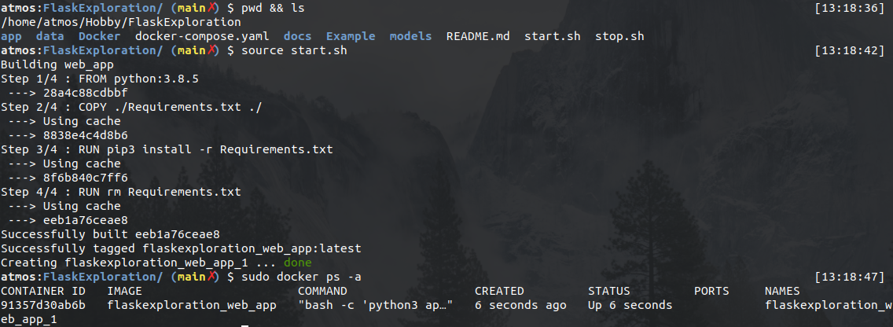
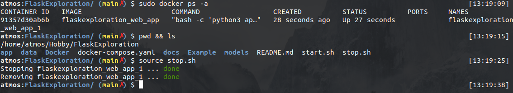

# Deploy API on machine (local/server)

From project directory (../FlaskExploration/) hit the next commands:

* to start web api: `source start.sh`
* to stop web api: `source stop.sh`

## Start API docker container

## Stop API docker container

